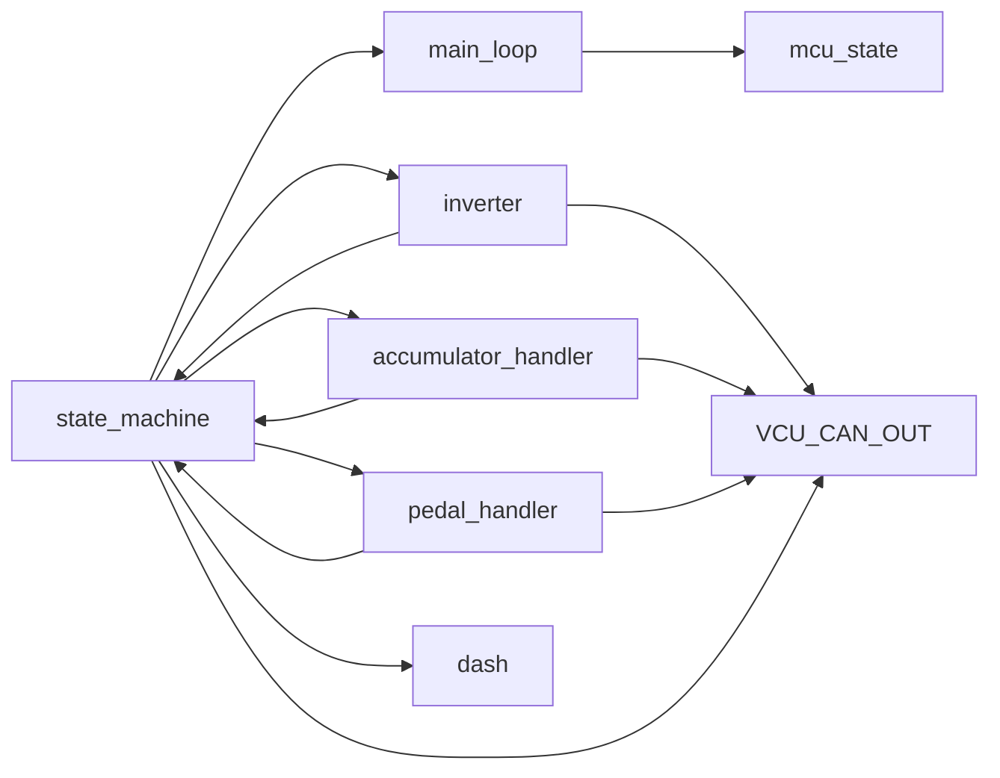
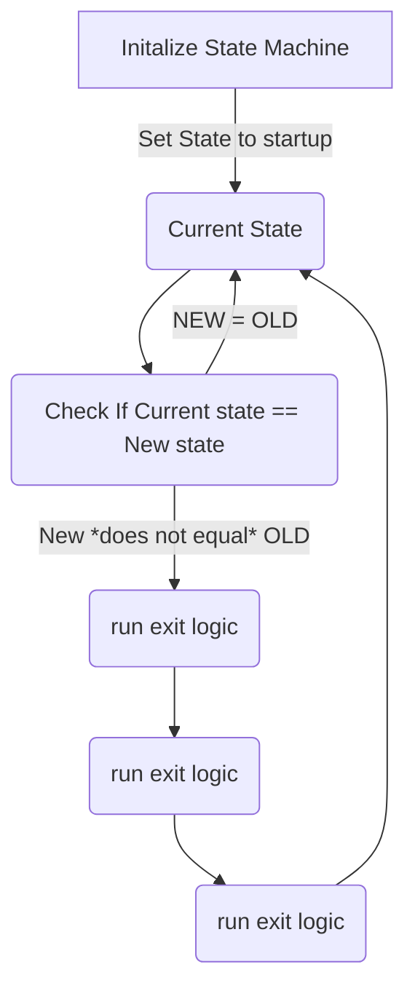
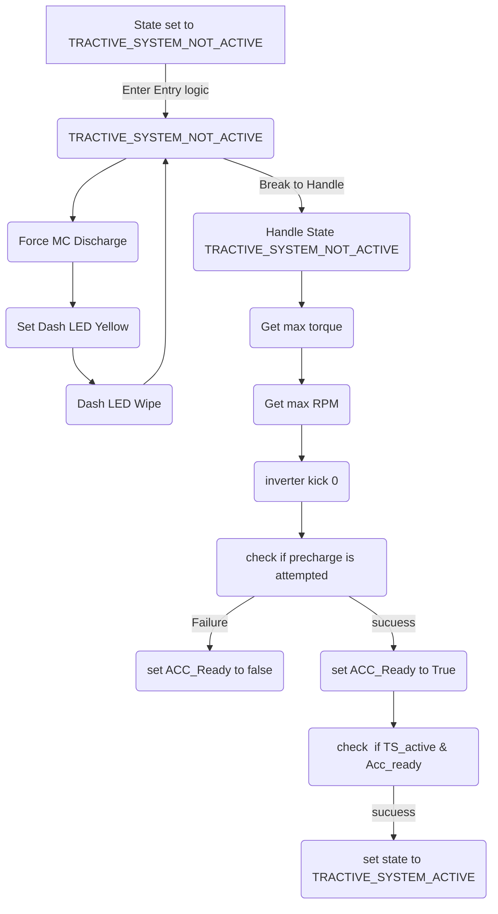
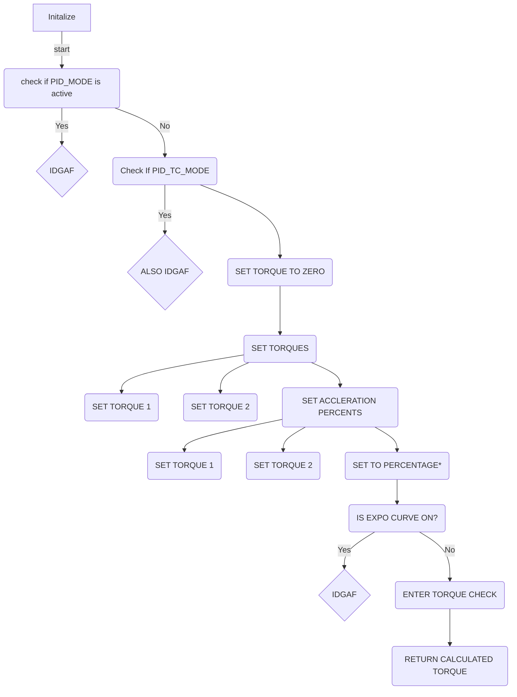
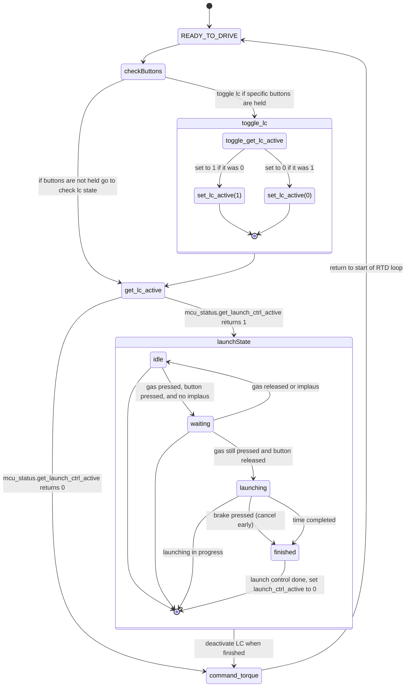

# design 
balls
the vcu CAN out is still TODO mostly, currently it spits out all RX / TX traffic

below is a loose flow of the data and what handles what


## building
to build, run ```pio run -e teensy41```
## Running tests

to build and run native tests on windows, follow these instructions: https://code.visualstudio.com/docs/cpp/config-mingw 
then, run tests by calling ```pio test -e test_env```



This is tha basic of the state machien. 
    the car is set to state








## launch control state diagram


